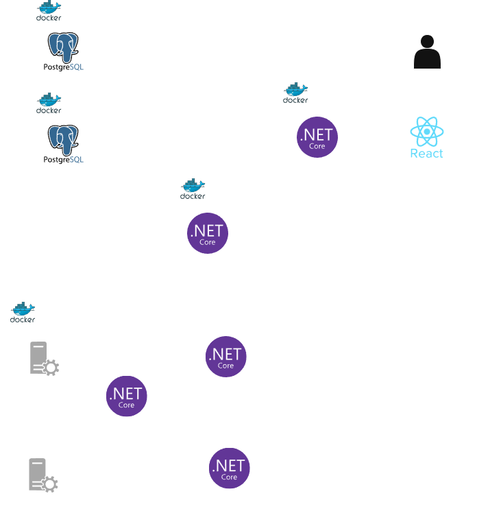
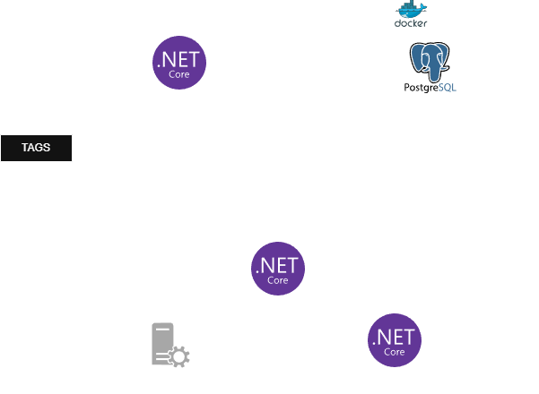
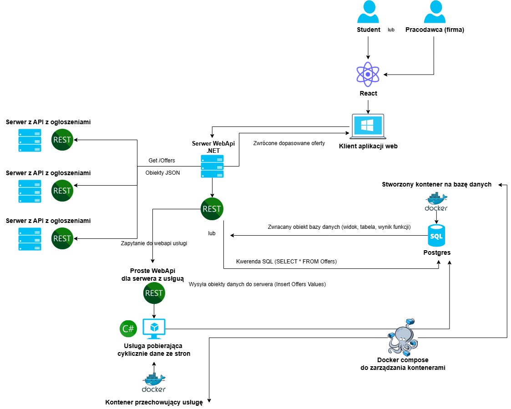

# StudentWorkHub
The application allows searching for job offers and assignments for students by integrating with systems such as Pracuj.pl, OlxPraca and many others, through API methods and WebScraping.

### Documentation online ###
https://docs.google.com/document/d/1mnvTexeT-fP2AOvFTb8ArKLz-O7-UmGf/edit?usp=sharing&ouid=110049717963508518977&rtpof=true&sd=true

### Second revision of application project schema ###
#### With database backup and logging service ####

### Second revision of application project schema ###

#### Offers gathering schema ####

**Icons used in the diagrams:**
[react-wordmark](https://icon-sets.iconify.design/devicon/?icon-filter=react-wordmark), [dotnetcore](https://icon-sets.iconify.design/devicon/?icon-filter=dotnetcore), and [postgresql-wordmark](https://icon-sets.iconify.design/devicon/?icon-filter=postgresql-wordmark) icons by konpa, licensed under the MIT License.

### First revision of application project schema ###

