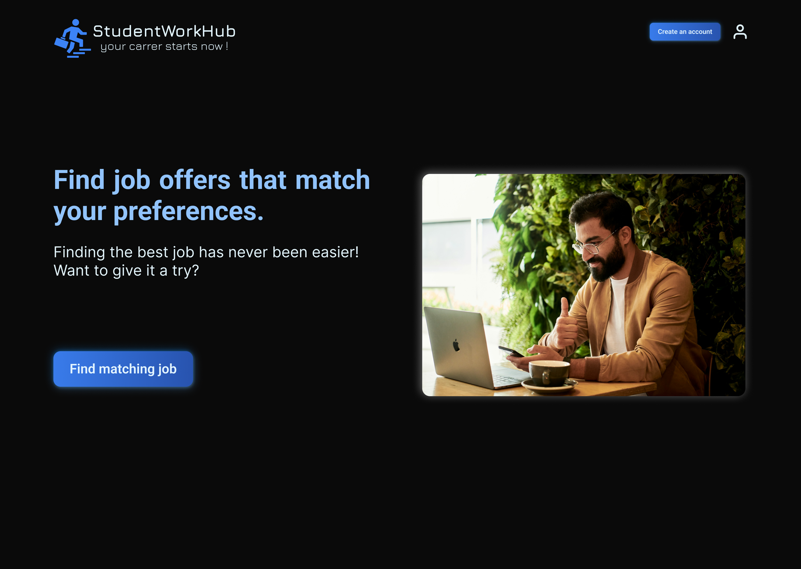
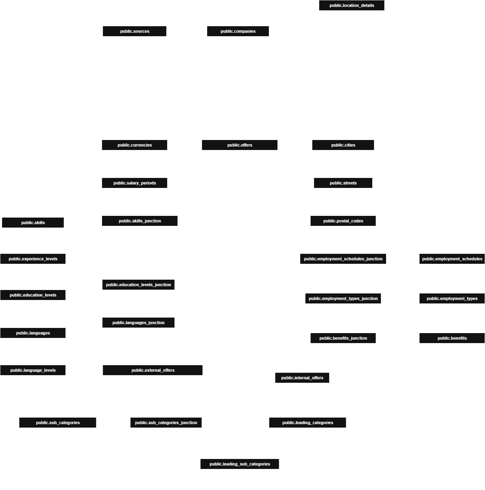
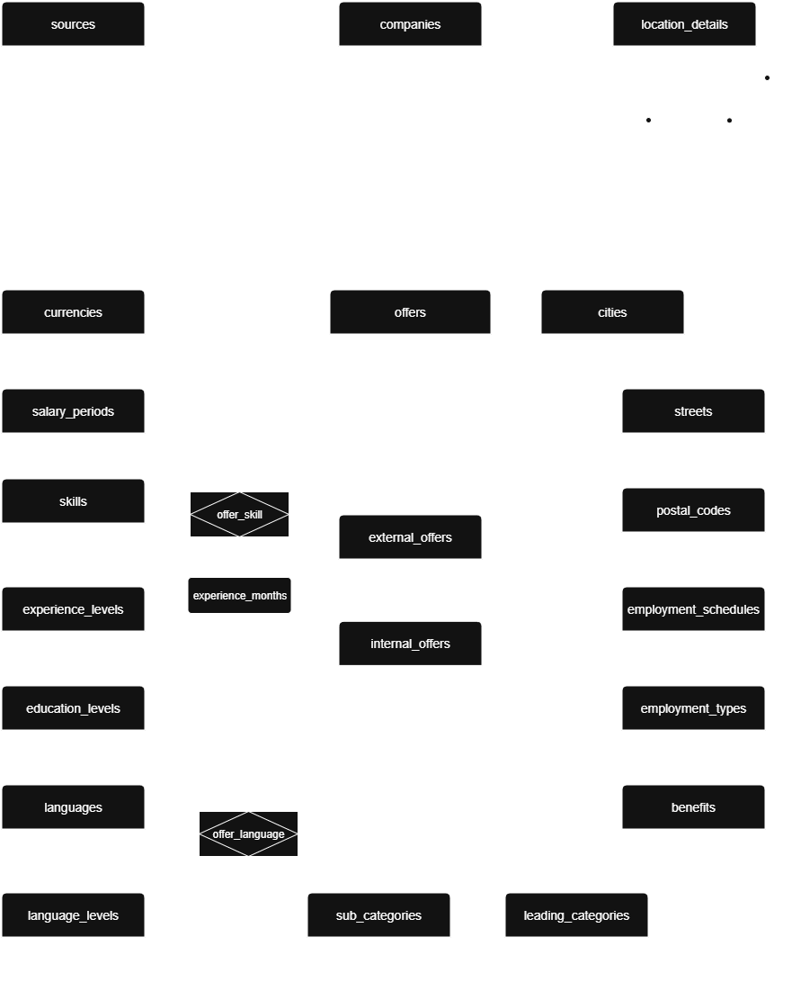
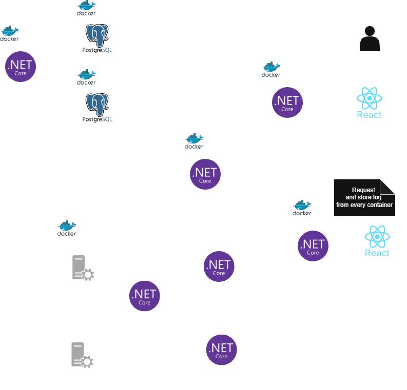

# StudentWorkHub
The application allows searching for job offers and assignments for students by integrating with systems such as Pracuj.pl, OlxPraca and many others, through API methods and WebScraping.

### Documentation online ###
https://docs.google.com/document/d/1mnvTexeT-fP2AOvFTb8ArKLz-O7-UmGf/edit?usp=sharing&ouid=110049717963508518977&rtpof=true&sd=true

## Design preview ##


## Database schemas ##
### Offers database ###

#### First revision of physical schema for offers database ####
> ℹ Internal offer–specific fields will be included in future revisions, after the creation of the internal offer schema.

> ℹ Physical model is developed with `PostgreSQL` in mind, so field types are using `PostgreSQL` naming.

> ⚠ Database allows only one mastery level per language, in case of more than one mastery level listed in offer, lowest level should be selected. Same logic applies to skills. Every skill may have only one mastery level or/and experience years listed.



#### First revision of logical ERD schema for offers database ####
> ℹ Internal offer–specific fields will be included in future revisions, after the creation of the internal offer schema.



### Offer positioning algorithm ###
> ℹ Displayed offers are arranged according to user preferences. Algorithm weights may adjust based on user actions. To establish the initial weights, the user will be asked a few questions.

#### First user survey ####
> ℹ These questions are used to identify the user's basic preferences.

1. Please indicate the city where you would like to work? (select or enter city).
2. Please select the jobs you are interested in (prepared offers, multiple options possible).
3. Please select the industries in which you would like to work (multiple options possible).
4. Please indicate your preferred salary range (two number fields).
5. What mode of work do you prefer (remote, on-site, hybrid) – multiple options possible.
6. Are company perks important to you? (categories e.g. health, sports, general).
7. Please indicate the working hours that suit you (two number fields).
8. Are you in urgent need of work? (checkbox).
9. What form of contract do you prefer (contract of employment, contract of mandate, B2B, contract for specific work, fixed-term contract)?

... possible additional questions for our portal, e.g. when you prefer to receive new job offers (e-mail notification)

#### Algorithm ####

### Unified offer schema ###
> ℹ The `Unified offer schema` standardizes job offers from multiple sources. This transformation enables algorithmic ranking of offers according to user preferences, even when API responses differ in structure. It also simplifies data storage and eliminates redundant site-specific additions.

#### `Unified offer schema` structure: ####
```json
{
    "id": null,
    "source": "",
    "url": "",
    "jobTitle": "",
    "company": {
        "name": "",
        "logoUrl": null
    },
    "description": null,
    "salary": {
        "from": null,
        "to": null,
        "currency": null,
        "period": null,
        "type": null
    },
    "location": {
        "buildingNumber": null,
        "street": null,
        "city": null,
        "postalCode": null,
        "coordinates": {
            "latitude": null,
            "longitude": null
        },
        "isRemote": null,
        "isHybrid": null
    },
    "category": {
        "leadingCategory": "",
        "subCategories": null
    },
    "requirements": {
        "skills": [
            {
                "skill": "",
                "experienceMonths": null,
                "experienceLevel": null
            }
        ],
        "education": null,
        "languages": [
            {
                "language": "",
                "level": ""
            }
        ]
    },
    "employment": {
        "types": [],
        "schedules": []
    },
    "dates": {
        "published": "",
        "expires": null
    },
    "benefits": null,
    "isUrgent": false,
    "isForUkrainians": false
}
```

#### `Unified offer schema` fields description ####
- `id`: *number* - Unique offer identifier.
- `source`: *string* - Offer source **(e.g. "pracuj.pl", "olx")**, used to quickly identify offer provider.
- `url`: *string* - Offer URL, used to redirect to the original offer source.
- `jobTitle`: *string* - Job title listed in offer.
- `company`: *object* - Issuing company details:
    - `name`: *string* - Company name.
    - `logoUrl`: *string|null* - Company logo *(optional)*.
- `description`: *string|null* - Offer description, used for AI-powered tag extraction *(optional)*.
- `salary`: *object* - Job salary details:
    - `from`: *number|null* - Minimum salary *(optional)*.
    - `to`: *number|null* - Maximum salary *(optional)*.
    - `currency`: *string|null* - Salary currency **(e.g. "PLN", "EUR")** *(optional when `from` and `to` are **null**)*.
    - `period`: *string|null* - Payment period **(e.g. monthly, weekly, daily)** *(optional when `from` and `to` are **null**)*
    - `type`: *string|null* - Salary type **(e.g. gross/net)** *(optional when `from` and `to` are **null**)*.
- `location`: *object* - Work location:
    - `buildingNumber`: *string|null* - Building number *(optional)*.
    - `street`: *string|null* - Street name *(optional)*.
    - `city`: *string|null* - City *(optional)*.
    - `postalCode`: *string|null* - Postal code *(optional)*.
    - `coordinates`: *object* - Location coordinates:
        - `latitude`: *number|null* - Latitude, used to estimate distance *(is **null** when longitude is **null**)*.
        - `longitude`: *number|null* - Longitude, used to estimate distance *(is **null** when latitude is **null**)*.
    - `isRemote`: *boolean|null* - Indicates if the work is fully remote *(is **null** when isHybrid is not **null**)*.
    - `isHybrid`: *boolean|null* - Indicates if the work is hybrid **(partially remote, partially on-site)** *(is **null** when isRemote is not **null**)*.
- `category`: *object* - offer category:
    - `leadingCategory`: *string* - Main offer category **(e.g. Information-Technology, Healthcare, Finance)**.
    - `subCategories`: *array|null* - offer categories **(e.g. ["Programming", "Architecture", "Designing"])** *(optional)*.
- `requirements`: *object* - Work requirements:
    - `skills`: *array|null* - Required skills *(optional)*.
        - `skill`: *string* - Skill name **(e.g. "C++", "Django", "Driver's license")**
        - `experienceMonths`: *number|null* - Required months of experience *(optional)*.
        - `experienceLevel`: *array|null* - Required experience level **(e.g. ["Senior", "Intermediate"])** *(optional)*.
    - `education`: *array|null* - Required education **(e.g. ["Bachelor's degree", "CCNA"])** *(optional)*.
    - `languages`: *array|null* - Required languages *(optional)*.
        - `language`: *string* - Language name **(e.g. English, German)**.
        - `level`: *string* - Language mastery level **(e.g. A2, C1)**
- `employment`: *object* - Employment details:
    - `types`: *array* - Type of employment contract **(e.g. ["Contract of mandate", "B2B"])**.
    - `schedules`: *array* - Work schedule **(e.g. ["Full-time", "Part-time"])**.
- `dates`: *object*: - Offer lifecycle dates:
    - `published`: *string* - Offer publication date **(format: `YYYY-MM-DD HH:MI:SS`)**.
    - `expires`: *string|null* - Offer expiration date **(format: `YYYY-MM-DD HH:MI:SS`)** *(optional)*.
- `benefits`: *array|null* - Employee benefits offered by the company **(e.g. private medical care, sports card)** *(optional)*.
- `isUrgent`: *boolean* - Indicates whether the company needs to hire urgently.
- `isForUkrainians`: *boolean* - Indicates whether the position is mainly intended for Ukrainian applicants.

#### Unified offer schema example ####
```json
{
    "id": 123,
    "source": "pracuj.pl",
    "url": "https://www.pracuj.pl/praca/inzynier-ka-oprogramowania-python-mid-senior-warszawa-kolska-12,oferta,1004183523",
    "jobTitle": "Inżynier /-ka oprogramowania Python (mid/senior)",
    "company": {
        "name": "NASK",
        "logoUrl": "https://logos.gpcdn.pl/loga-firm/20011564/54330000-56be-0050-f1b2-08dd9c317145_280x280.png"
    },
    "description": "Twój zakres obowiązków, Implementacja rozwiązań na podstawie wymagań projektowych, Implementacja testów automatycznych, Przeglądy kodu kolegów z zespołu, Aktywny udział w spotkaniach zespołu projektowego, w tym proponowanie nowych rozwiązań i...",
    "salary": {
        "from": 7000,
        "to": 16000,
        "currency": "PLN",
        "period": "mies.",
        "type": "brutto"
    },
    "location": {
        "buildingNumber": null,
        "street": null,
        "city": "Warszawa",
        "postalCode": null,
        "coordinates": {
            "latitude": 52.25102615356445,
            "longitude": 20.975749969482422
        },
        "isRemote": null,
        "isHybrid": true
    },
    "category": {
        "leadingCategory": "Information-Technology",
        "subCategories": ["Programming", "Backend Development"]
    },
    "requirements": {
    "skills": [
        {
            "skill": "Python",
            "experienceMonths": 2,
            "experienceLevel": ["Mid"]
        },
        {
            "skill": "Django",
            "experienceMonths": 1,
            "experienceLevel": ["Junior", "Mid"]
        },
        {
            "skill": "FastAPI",
            "experienceMonths": null,
            "experienceLevel": ["Mid"]
        },
        {
            "skill": "Web Services",
            "experienceMonths": null,
            "experienceLevel": ["Mid", "Senior"]
        },
        {
            "skill": "HTTP",
            "experienceMonths": null,
            "experienceLevel": ["Mid"]
        },
        {
            "skill": "REST",
            "experienceMonths": null,
            "experienceLevel": ["Mid"]
        },
        {
            "skill": "SQL",
            "experienceMonths": 1,
            "experienceLevel": ["Mid"]
        },
        {
            "skill": "ORM",
            "experienceMonths": null,
            "experienceLevel": ["Mid"]
        },
        {
            "skill": "Celery",
            "experienceMonths": null,
            "experienceLevel": ["Mid"]
        }
        ],
        "education": null,
        "languages": [
            {
                "language": "English",
                "level": "B2"
            }
        ]
    },
    "employment": {
        "types": [
            "Umowa o pracę"
        ],
        "schedules": [
            "Pełny etat"
        ]
    },
    "dates": {
        "published": "2025-07-04 14:33:00",
        "expires": "2025-07-24 21:59:59"
    },
    "benefits": null,
    "isUrgent": false,
    "isForUkrainians": false
}
```

### Second revision of application project schema ###
#### With database backup and logging service ####


**Icons used in the diagrams:**
[react-wordmark](https://icon-sets.iconify.design/devicon/?icon-filter=react-wordmark), [dotnetcore](https://icon-sets.iconify.design/devicon/?icon-filter=dotnetcore), and [postgresql-wordmark](https://icon-sets.iconify.design/devicon/?icon-filter=postgresql-wordmark) icons by konpa, licensed under the MIT License.
