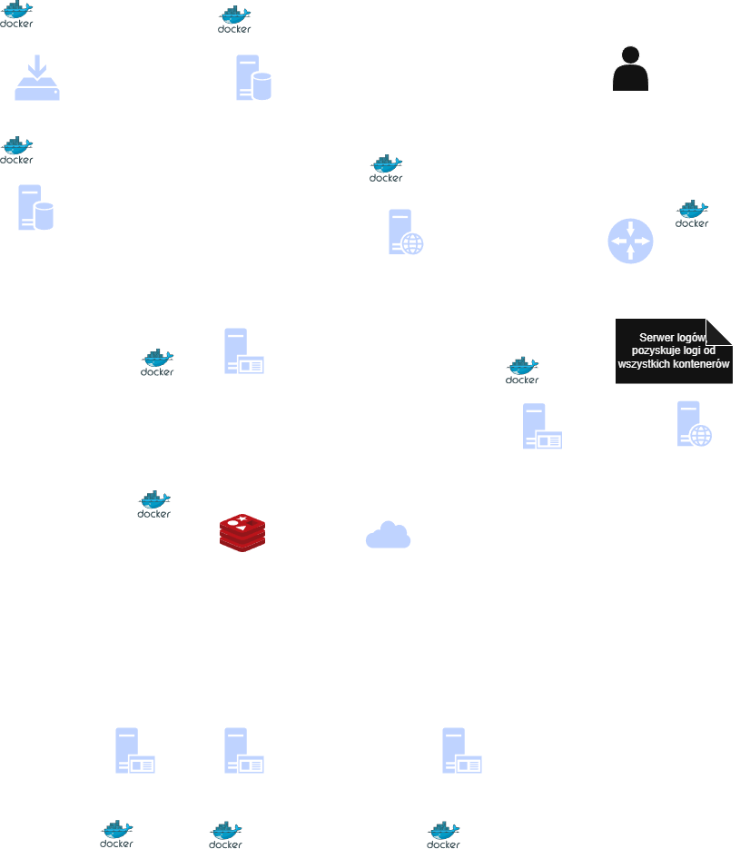
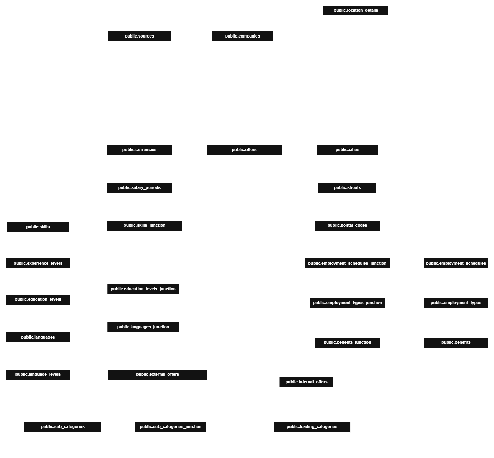
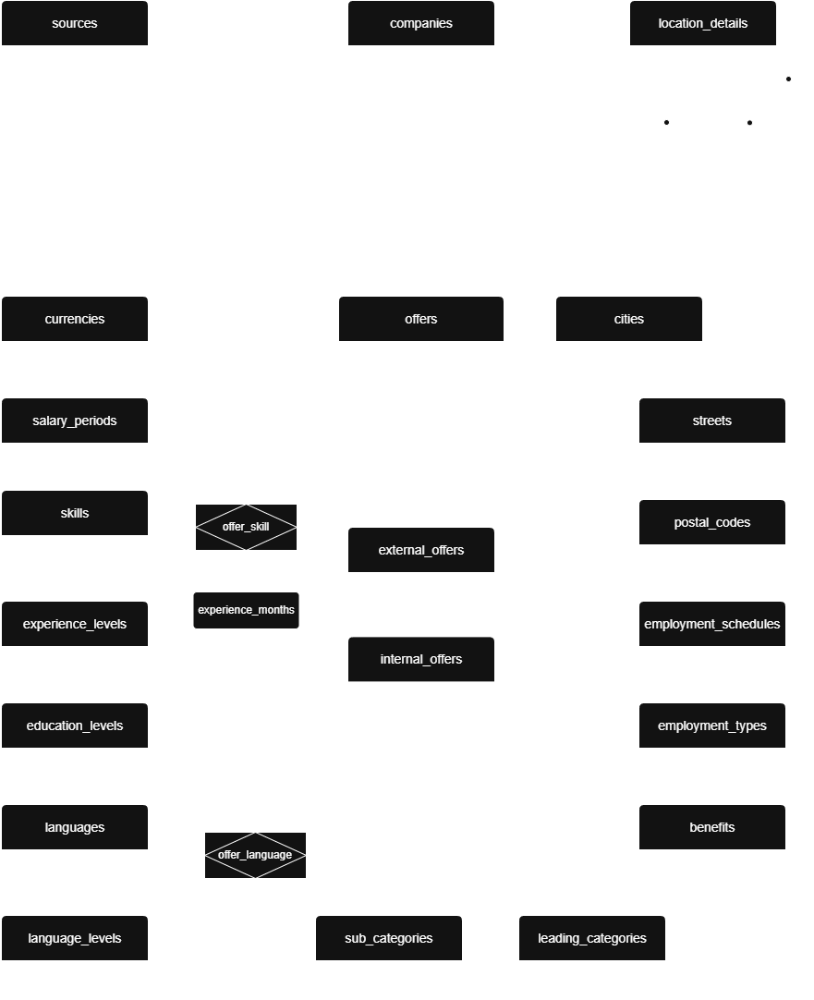
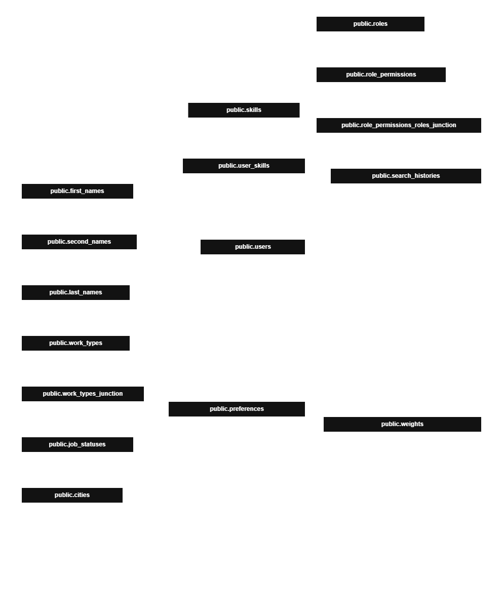
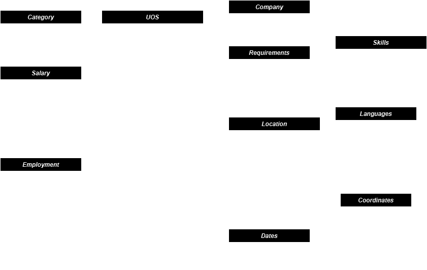

# StudentWorkHub #
The application allows searching for job offers and assignments for students by integrating with systems such as Pracuj.pl, OlxPraca and many others, through API methods and WebScraping.

## Design preview ##

### Third revision of system schema ###

## Database schemas ##
### Offers database ###

#### Fourth revision of physical schema for `Offers` database ####
> ℹ Internal offer–specific fields will be included in future revisions, after the creation of the internal offer schema.

> ℹ Physical model is developed with `PostgreSQL` in mind, so field types are using `PostgreSQL` naming.

> ⚠ Database allows only one mastery level per language, in case of more than one mastery level listed in offer, lowest level should be selected. Same logic applies to skills. Every skill may have only one mastery level or/and experience years listed.

#### Third revision of logical ERD schema for `Offers` database ####
> ℹ Internal offer–specific fields will be included in future revisions, after the creation of the internal offer schema.

### General database ###

#### First revision of physical schema for `General` database ####
> ℹ Physical model is developed with `PostgreSQL` in mind, so field types are using `PostgreSQL` naming.

### Offer positioning algorithm ###
> ℹ Displayed offers are arranged according to user preferences. Algorithm weights may adjust based on user actions. To establish the initial weights, the user will be asked a few questions.

#### First user survey ####
> ℹ These questions are used to identify the user's basic preferences.

1. Which study track or career direction are you interested in?
2. What professional experiences and skills would you like to add, and how many months for each?
3. What salary range do you expect, and is it hourly or monthly?
4. Which contract types are you interested in?
5. What is your current job-search status?
6. What is your native language?
7. Which other languages do you know?
8. In which city are you looking for a job?
9. What employment mode do you prefer?

#### Algorithm ####
The system uses **feature extraction and normalization** in an **eight-dimensional feature space**, **offer scoring**, and **continuous online learning** from **implicit user feedback** (e.g., **clicks** and **hovers**). It combines **RReliefF** for **feature weighting** with an **SGD-based model** trained using the **ADAM optimizer**. To stabilize updates, it applies **signal accumulation** and maintains **streaming statistics** using **Welford’s online algorithm**.

### Unified offer schema ###
> ℹ The `Unified offer schema` standardizes job offers from multiple sources. This transformation enables algorithmic ranking of offers according to user preferences, even when API responses differ in structure. It also simplifies data storage and eliminates redundant site-specific additions.

#### `Unified offer schema` fields description ####
- `id`: *number* - Unique offer identifier.
- `source`: *string* - Offer source **(e.g. "pracuj.pl", "olx")**, used to quickly identify offer provider.
- `url`: *string* - Offer URL, used to redirect to the original offer source.
- `jobTitle`: *string* - Job title listed in offer.
- `company`: *object* - Issuing company details:
    - `name`: *string* - Company name.
    - `logoUrl`: *string|null* - Company logo *(optional)*.
- `description`: *string|null* - Offer description, used for AI-powered tag extraction *(optional)*.
- `salary`: *object* - Job salary details:
    - `from`: *number|null* - Minimum salary *(optional)*.
    - `to`: *number|null* - Maximum salary *(optional)*.
    - `currency`: *string|null* - Salary currency **(e.g. "PLN", "EUR")** *(optional when `from` and `to` are **null**)*.
    - `period`: *string|null* - Payment period **(e.g. monthly, weekly, daily)** *(optional when `from` and `to` are **null**)*
    - `type`: *string|null* - Salary type **(e.g. gross/net)** *(optional when `from` and `to` are **null**)*.
- `location`: *object* - Work location:
    - `buildingNumber`: *string|null* - Building number *(optional)*.
    - `street`: *string|null* - Street name *(optional)*.
    - `city`: *string|null* - City *(optional)*.
    - `postalCode`: *string|null* - Postal code *(optional)*.
    - `coordinates`: *object* - Location coordinates:
        - `latitude`: *number|null* - Latitude, used to estimate distance *(is **null** when longitude is **null**)*.
        - `longitude`: *number|null* - Longitude, used to estimate distance *(is **null** when latitude is **null**)*.
    - `isRemote`: *boolean|null* - Indicates if the work is fully remote *(is **null** when isHybrid is not **null**)*.
    - `isHybrid`: *boolean|null* - Indicates if the work is hybrid **(partially remote, partially on-site)** *(is **null** when isRemote is not **null**)*.
- `category`: *object* - offer category:
    - `leadingCategory`: *string* - Main offer category **(e.g. Information-Technology, Healthcare, Finance)**.
    - `subCategories`: *array|null* - offer categories **(e.g. ["Programming", "Architecture", "Designing"])** *(optional)*.
- `requirements`: *object* - Work requirements:
    - `skills`: *array|null* - Required skills *(optional)*.
        - `skill`: *string* - Skill name **(e.g. "C++", "Django", "Driver's license")**
        - `experienceMonths`: *number|null* - Required months of experience *(optional)*.
        - `experienceLevel`: *array|null* - Required experience level **(e.g. ["Senior", "Intermediate"])** *(optional)*.
    - `education`: *array|null* - Required education **(e.g. ["Bachelor's degree", "CCNA"])** *(optional)*.
    - `languages`: *array|null* - Required languages *(optional)*.
        - `language`: *string* - Language name **(e.g. English, German)**.
        - `level`: *string* - Language mastery level **(e.g. A2, C1)**
- `employment`: *object* - Employment details:
    - `types`: *array* - Type of employment contract **(e.g. ["Contract of mandate", "B2B"])**.
    - `schedules`: *array* - Work schedule **(e.g. ["Full-time", "Part-time"])**.
- `dates`: *object*: - Offer lifecycle dates:
    - `published`: *string* - Offer publication date **(format: `YYYY-MM-DD HH:MI:SS`)**.
    - `expires`: *string|null* - Offer expiration date **(format: `YYYY-MM-DD HH:MI:SS`)** *(optional)*.
- `benefits`: *array|null* - Employee benefits offered by the company **(e.g. private medical care, sports card)** *(optional)*.
- `isUrgent`: *boolean* - Indicates whether the company needs to hire urgently.
- `isForUkrainians`: *boolean* - Indicates whether the position is mainly intended for Ukrainian applicants.

